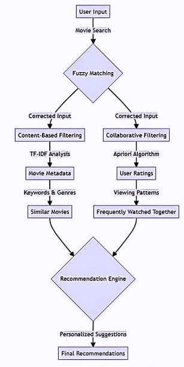

<div align="center">  </div>

**CineSLEUTH: Your Ultimate Engine for Movie Recommendations**

CineSLEUTH is an intelligent movie recommendation system that combines advanced machine learning techniques such as TF-IDF vectorization, cosine similarity, fuzzy matching, and Apriori-based collaborative filtering. The system provides highly accurate and personalized movie recommendations for users.

---

## Features

1. **Content-Based Filtering**:
   - Uses TF-IDF vectorization to calculate similarity based on genres and tags.
   - Cosine similarity is applied to find the closest matches.
   - Fuzzy matching ensures typos are handled effectively.

2. **Collaborative Filtering**:
   - Utilizes the Apriori algorithm to process user ratings and generate association rules for better recommendations.
   - Generates frequent itemsets for movies based on user behavior.

3. **Interactive User Experience**:
   - Auto-complete suggestions for movie titles with clickable options.
   - Streamlit interface for an interactive and responsive application.

4. **Real-Time Data Processing**:
   - Handles large datasets with chunk-based reading for scalability.

---

## Installation

1. Clone the repository:
   ```bash
   git clone https://github.com/AaryanGole26/CineSLEUTH.git
   cd CineSLEUTH
   ```

2. Install the required Python libraries:
   ```bash
   pip install -r requirements.txt
   ```

3. Add the required CSV files to the repository:
   - `movies.csv`
   - `ratings.csv`
   - `tags.csv`
   - `genome_tags.csv`

   You can fetch these datasets from [MovieLens 20M Dataset on Kaggle](https://www.kaggle.com/datasets/grouplens/movielens-20m-dataset).

---

## Usage

Run the application locally using Streamlit:
```bash
streamlit run CineSLEUTH.py
```

### Key Features in Action:
1. Enter a movie title in the input box.
2. Get auto-complete suggestions and click to see recommendations instantly.
3. Analyze the recommendations through a table of similarity scores.
4. View Apriori-based rules generated from collaborative filtering.

---

## Output Visualization

### Sample Output Video
Here is a sample video showcasing the output of CineSLEUTH:

<iframe src="https://player.vimeo.com/video/1033815078" width="640" height="360" frameborder="0" allow="autoplay; fullscreen" allowfullscreen></iframe>

*Example video showing movie recommendation process and visualization.*

---

## Flowchart of the System

The flowchart below represents the working of CineSLEUTH:

<div align="center">  </div>

*Flowchart depicting the movie recommendation process from user input to final recommendations.*

---

## File Structure 

- `CineSLEUTH.py`: Main Python script for the Streamlit application.
- `movies.csv`: Movie metadata.
- `ratings.csv`: User rating data.
- `tags.csv`: Tags associated with movies.
- `genome_tags.csv`: Genome tags dataset.
- `requirements.txt`: Required Modules.

---

## Technologies Used

- **Python Libraries**:
  - `pandas` for data manipulation.
  - `apyori` for association rule mining.
  - `sklearn` for TF-IDF vectorization and cosine similarity.
  - `fuzzywuzzy` for fuzzy matching of movie titles.
  - `matplotlib` and `seaborn` for data visualization.
  - `streamlit` for interactive UI.

- **Algorithms**:
  - Content-based filtering (TF-IDF + Cosine Similarity).
  - Collaborative filtering (Apriori Algorithm).

---

## Example Rules Generated (Apriori Algorithm)

- Rule: Movie A → Movie B
  - **Support**: 0.02
  - **Confidence**: 0.85
  - **Lift**: 3.5

---

## Contribution

Feel free to fork the repository, raise issues, or contribute to the project. Contributions are always welcome!

---

## License

This project is licensed under the MIT License.

---

## Contact

- **GitHub**: [AaryanGole26](https://github.com/AaryanGole26)
- **Repository**: [CineSLEUTH](https://github.com/AaryanGole26/CineSLEUTH)
